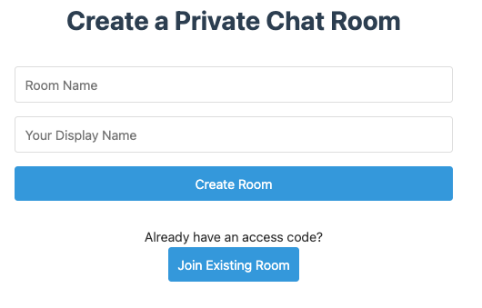

# Private Room Chat Application

A web-based chat application that enables users to create private chat rooms and invite others through QR codes. This application provides real-time chat functionality with room administration capabilities.

## Screenshot



## Features

- Create private chat rooms
- Generate unique QR codes for room access
- Real-time chat functionality
- Room administration capabilities
- Simple user registration with display names

## Tech Stack

### Frontend
- React.js
- WebSocket
- qrcode.react
- Styled-components

### Backend
- Node.js
- Express
- Socket.IO
- SQLite
- JWT

## Prerequisites

Before you begin, ensure you have the following installed:
- Node.js (v14 or higher)
- npm (v6 or higher)

## Installation

1. Clone the repository:
```bash
git clone [repository-url]
cd private-room-app
```

2. Install server dependencies:
```bash
npm install
```

3. Install client dependencies:
```bash
cd client
npm install
```

## Running the Application

1. Start the backend server:
```bash
# From the root directory
node server.js
```

2. Start the frontend development server:
```bash
# From the client directory
cd client
npm start
```

The application should now be running at:
- Frontend: http://localhost:8080
- Backend: http://localhost:3000

## Usage

### Creating a Room
1. Navigate to the homepage
2. Click on "Create Room"
3. Enter a room name
4. You'll receive a QR code and access URL for sharing

### Joining a Room
1. Scan the QR code or use the access URL
2. Enter your display name
3. Join the chat room

### Room Administration
As a room admin, you can:
- Monitor user activity
- Remove users
- Close the room

## Security Features

- Rate limiting for room creation
- Access code encryption
- Message sanitization
- Room expiry after inactivity

## Future Enhancements

- File sharing
- End-to-end encryption
- Room templates
- User authentication
- Message history

## License

[Add your license here]

## Contributing

[Add contribution guidelines here]